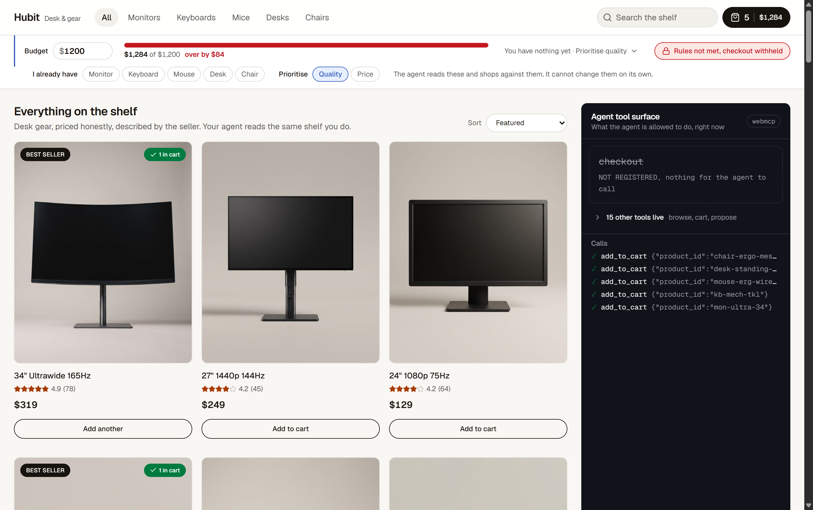
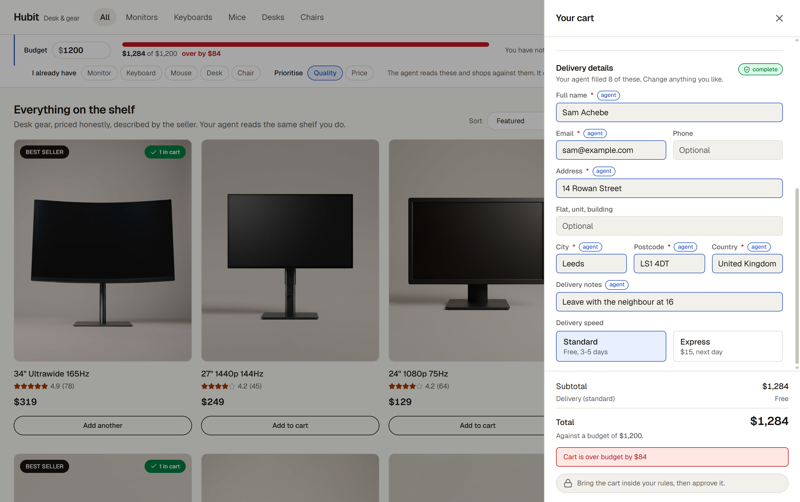
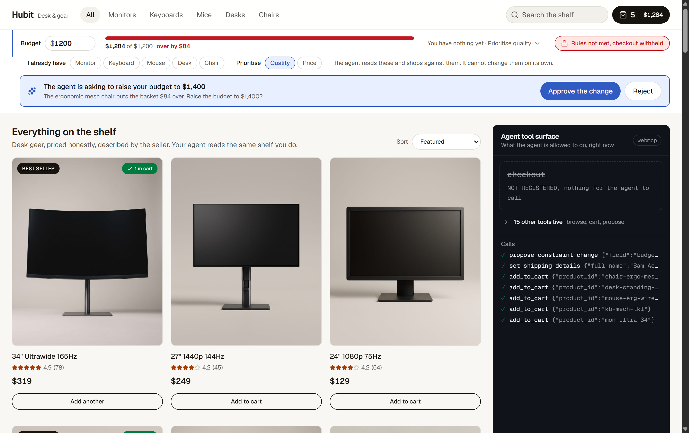
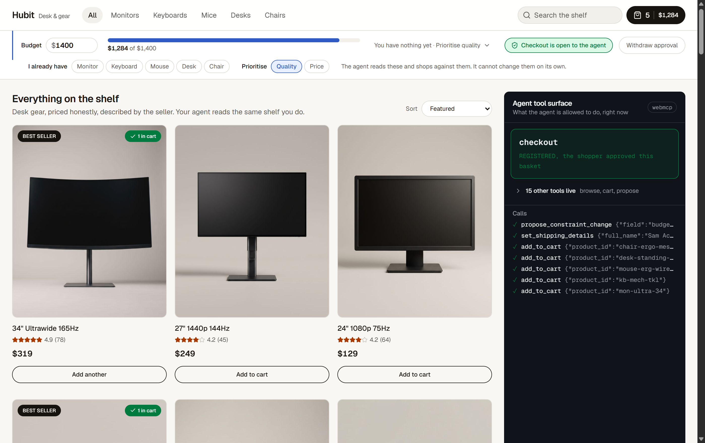
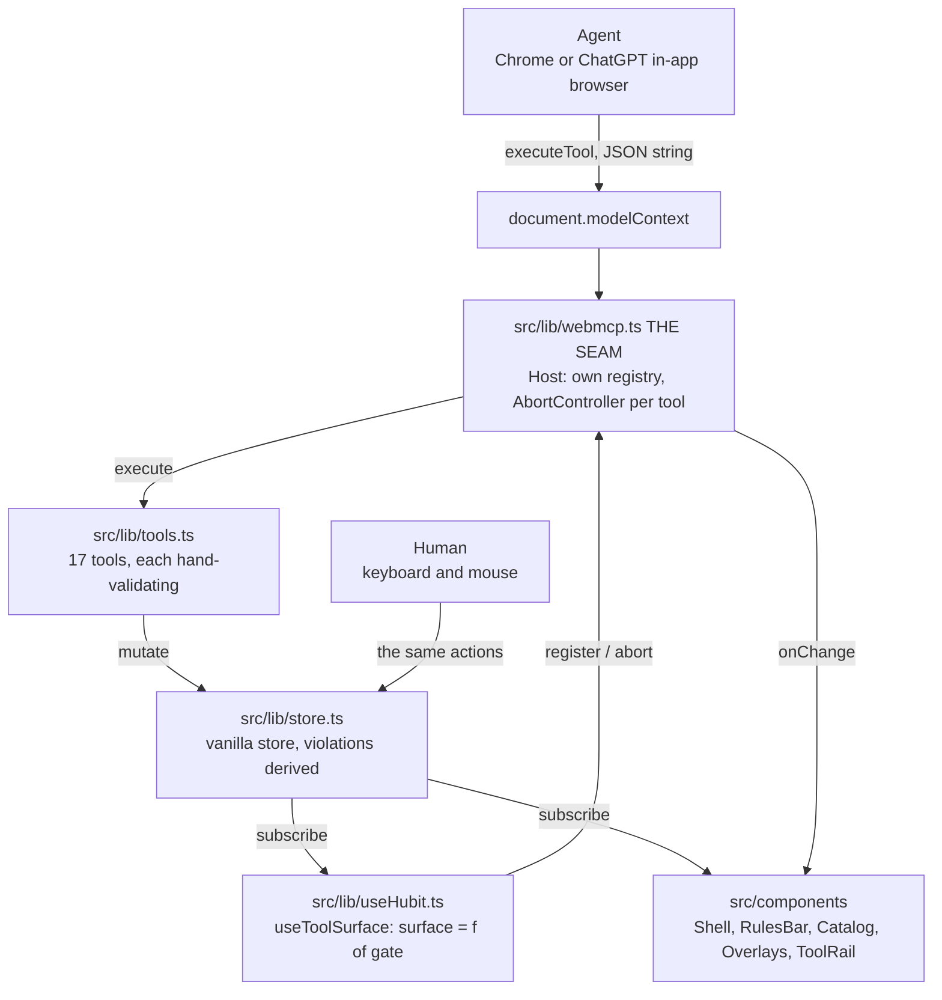

# Hubit

**A storefront where you can hand an agent the shopping without handing it your wallet.** **`checkout`** **is not refused by a server. It is not in the agent's toolbox at all until you approve the basket.**

[Live demo](https://hubit-store.vercel.app) · [Evaluation map](docs/evaluation-map.md) · [105-assertion capability audit](test/README.md) · [Runtime findings](docs/webmcp-findings.md) · [Technical decisions](docs/technical-decisions.md) · [Submission text](docs/submission-text.md)

> **Open the demo in Chrome with** **`chrome://flags/#enable-webmcp-testing`** **enabled and restarted, or in ChatGPT's in-app browser.** Those are the only two browsers that expose `document.modelContext`. Anywhere else the store still works by hand, but the agent tool surface is empty and you are looking at the wrong half of the project.



Built for **The WebMCP Challenge**, on the WebMCP standard, deployed on Vercel. Next.js 16, React 19, Tailwind v4, TypeScript. No backend, no database, no API routes.

***

## Contents

[The problem](#the-problem) · [The mechanic](#the-mechanic) · [Walkthrough](#walkthrough) · [The tool surface](#the-tool-surface-seventeen-tools) · [How WebMCP is implemented](#how-webmcp-is-implemented) · [The gate](#the-gate-one-boolean-three-conditions) · [Consent](#consent-is-per-basket) · [What we measured](#what-we-measured-about-the-runtime) · [Architecture](#architecture) · [Design](#the-design-language) · [The audit](#the-capability-audit) · [Run it](#run-it-yourself)

***

## The problem

People will happily let an agent *research* a purchase. Almost nobody lets one *finish* it.

The reason is not that agents are bad at shopping. It is that there has never been a mechanism that makes **"it can look but it cannot buy"** true rather than promised. Every guardrail on offer today is a server saying no, somewhere behind an API. A refusal is a message, a message is an input, and a model can be argued into retrying an input. So the shopper is left with two options, and both are bad: do the tedious part yourself, or hand over the cart and hope.

That gap is not theoretical. It is the exact task people already try to get an assistant to do, get 80% of the way through, and then abandon at the last step.

**The state of the art, checked rather than assumed.** Every public WebMCP storefront demo we could find, including the ones in `GoogleChromeLabs/webmcp-tools/demos`, registers `checkout` unconditionally alongside `search_products`. The agent can always complete the purchase. Not one of them models the human as an authority the agent has to come back to.

## The mechanic

Hubit's entire argument is a single property of WebMCP that no server-side guardrail can imitate:

> **The tool surface is a live, mutable property of the tab.** `registerTool` takes an `AbortSignal`. So a capability can be *absent*, then *appear* mid-conversation because a human decided something, then *disappear* again when they change their mind.

`checkout` is registered only while a gate is open:

```ts
// src/lib/store.ts:171
export function checkoutLive(s: State = state): boolean {
  return (
    violations(s).length === 0 && shippingComplete(s) && s.approved && s.order === null
  );
}
```

When that boolean is false, the agent cannot call `checkout`, cannot retry it, and cannot argue with it, because **there is nothing there**. `getTools()` does not list it. A stale tool handle captured before the abort is rejected at browser level when called. This is not a UI flag over a permission check. It is the capability itself, not existing.

## Walkthrough

**1. You set the rules, in the bar pinned under the header.** A budget, categories you already own, and whether you want quality or price. The agent can read these through `get_constraints` and it can *ask* to change them, but it has no tool that changes them directly.

**2. The agent shops.** It calls `search_products`, `compare_products` and `search_alternatives`, then `add_to_cart`. Every call streams into the tool rail on the right with its real arguments. It can also move your screen: `filter_catalog` changes the shelf you are looking at and `focus_product` opens a quick view, so you can watch it think instead of reading a transcript of it.

**3. It fills in your delivery form.** `set_shipping_details` writes your name, email, address, postcode, country, delivery speed and courier notes. It writes to the same store your keyboard writes to. There is no separate agent path, which is exactly what makes the provenance honest: every field the agent typed is outlined in the accent colour and tagged `agent`, and you can overwrite any of them.



This is the picture of the whole thesis. **The agent can type your address and still cannot spend your money.**

**4. It reaches for checkout, and the tool is not there.** The cart is $1,284 against a $1,200 budget. Its only remaining move is to ask you:



`propose_constraint_change` queues a proposal and changes nothing by itself. Note that the tool rail *still* shows `checkout` as absent. Approving the budget change satisfies one of three conditions, not all of them.

**5. You approve the basket, and the tool appears.** Live, in the same tab, with no reload.



**And it is revocable, not just grantable.** Drag the budget back down, edit the cart, change the delivery address, or click "Withdraw approval", and `checkout` leaves the surface again mid-session.

## The tool surface: seventeen tools

Fifteen are always registered. Two are conditional, and they are conditional in **opposite directions**.

| Tool                        | Annotations                 | What it does                                                          |
| --------------------------- | --------------------------- | --------------------------------------------------------------------- |
| `search_products`           | `readOnly`, `untrusted`     | Search the catalog by free text, category or maximum price            |
| `get_product`               | `readOnly`, `untrusted`     | One product by id, with full specs and the seller's description       |
| `compare_products`          | `readOnly`, `untrusted`     | Two to five products side by side, spec by spec, with the price delta |
| `search_alternatives`       | `readOnly`, `untrusted`     | Cheaper replacements in the same category, and what each one gives up |
| `get_cart`                  | `readOnly`                  | The cart, its total, and whether it satisfies the rules               |
| `get_constraints`           | `readOnly`                  | The shopper's budget, have-list and priority                          |
| `get_shipping_details`      | `readOnly`                  | The delivery form, and exactly which required fields are still blank  |
| `add_to_cart`               | <br />                      | Add by id, then re-check the constraints                              |
| `remove_from_cart`          | <br />                      | Remove by id                                                          |
| `update_quantity`           | <br />                      | Change a quantity. Zero removes the line                              |
| `clear_cart`                | <br />                      | Empty the basket                                                      |
| `set_shipping_details`      | <br />                      | Fill any subset of the delivery form                                  |
| `propose_constraint_change` | <br />                      | Ask the shopper to change a rule. Queues a proposal, changes nothing  |
| `filter_catalog`            | <br />                      | Move the shopper's view: filter the shelf by category and search term |
| `focus_product`             | <br />                      | Open or close the quick view on the shopper's screen                  |
| **`checkout`**              | **conditional**             | **Registered only while the gate is open**                            |
| **`get_order`**             | **conditional**, `readOnly` | **Registered only once an order exists**                              |

Three details in that table are deliberate and are the kind of thing a reviewer notices:

* **`untrustedContentHint`** **is on exactly the tools that return seller-authored prose.** Product names, specs and descriptions are copy we did not write. Marking them lets whatever consumes the result treat them as data rather than instruction.

* **`filter_catalog`** **and** **`focus_product`** **carry no** **`readOnlyHint`.** Changing what a human is looking at is a side effect. Labelling it read-only would lie to whatever decides which tools are safe to call unattended, and it would be a comfortable lie, which is worse.

* **`get_order`** **exists so the surface can swap, not only shrink.** `placeOrder()` is one state change that removes `checkout` and adds `get_order`. A WebMCP tool list is not a static manifest with one hole punched in it. It tracks the state of the page.

## How WebMCP is implemented

### One seam

[`src/lib/webmcp.ts`](src/lib/webmcp.ts) is the **only** file in the project that touches `document.modelContext`. 165 lines. Everything else in the app talks to a `ToolHost` interface, which means the runtime's quirks are contained in one reviewable place instead of smeared across the components.

Inside it, a `Host` class keeps **our own registry** alongside the browser's, and every registration owns an `AbortController`:

```ts
// src/lib/webmcp.ts, register()
const controller = new AbortController();
this.entries.set(def.name, { def, controller });

document.modelContext.registerTool({
  name: def.name,
  description: def.description,
  inputSchema: def.inputSchema,
  ...(def.annotations ? { annotations: def.annotations } : {}),
  execute: async (input: unknown) => def.execute(input),
}, { signal: controller.signal });

return () => {
  controller.abort();          // the real revocation, not a UI flag
  this.entries.delete(def.name);
  this.emit();
};
```

That is the call verbatim, not a paraphrase — `document.modelContext.registerTool({…})` is written out at the call site rather than through a cached `this.mc` alias, so the API the page actually drives is the one you can grep for. Presence is a runtime question, answered by a feature test before the call is reached; `Document.modelContext` is declared in the same file so the call needs no `!` and no cast.

`registerTool` in Chrome 152 returns a promise that **rejects with** **`AbortError`** the instant the signal fires. That rejection *is* the revocation working. Left unhandled it printed one red `unhandledRejection` per tool on every gate change, which is precisely the moment the demo is recording. So it is swallowed when `controller.signal.aborted` is true, and still surfaced when it is not, because a genuine registration failure must never be invisible.

### The surface is derived state, rebuilt whole

The obvious implementation registers the base tools once and toggles `checkout` in a second effect. We built that first and it was subtly wrong: `checkout` ended up callable-but-rejecting in the window between the two effects.

The fix is to stop treating registration as an imperative action and treat the whole surface as a function of the gate:

```ts
// src/lib/useHubit.ts:20
useEffect(() => {
  const host = getHost();
  const surface = [
    ...BASE_TOOLS,
    ...(live ? [CHECKOUT_TOOL] : []),
    ...(ordered ? [ORDER_TOOL] : []),
  ];
  const offs = surface.map((t) => host.register(t));
  return () => offs.forEach((off) => off());
}, [live, ordered]);
```

Every gate change tears down and rebuilds the entire surface. It costs a handful of extra `registerTool` calls and it buys the guarantee that the browser's registry and the page's state can never disagree.

### The UI subscribes to the registry, it does not read it

This one shipped as a bug and cost us the demo's best beat for an hour.

Registration happens inside that effect, which runs **after** the render caused by the store change that opened the gate. Reading `getHost().list()` during render therefore showed the registry as it was one update ago: approving the basket flipped the rules bar to "Checkout is open" while the rail still said NOT REGISTERED, which is the exact opposite of the claim, at the exact instant the demo turns on.

```ts
// src/lib/useHubit.ts, useLiveToolNames()
return useSyncExternalStore(
  (cb) => getHost().onChange(cb),
  () => getHost().list().map((t) => t.name).sort().join(","),
  () => ""
);
```

The snapshot is a **joined string** so React can compare it by value. A fresh `Set` or array here is a new reference on every call and never settles.

The rail then renders from the host's actual registry rather than from the `BASE_TOOLS` array. If a tool ever failed to register, the rail shows that instead of claiming it is live.

### Never render from `toolchange`

`toolchange` fires on `document.modelContext` in Chrome. In ChatGPT's in-app browser, `modelContext` is **not an** **`EventTarget`** **at all** and `addEventListener` throws `TypeError`. A rail repainted from `toolchange` would therefore be frozen on one of the two surfaces judges are told to use.

We attach it anyway, guarded, purely as a Chrome-only cross-check, and nothing in the UI renders from it.

### The headers

WebMCP wants an origin-isolated document. Both headers are set in [`next.config.ts`](next.config.ts) and are live on the deployment:

```
Origin-Agent-Cluster: ?1
Permissions-Policy: tools=(self)
```

## The gate: one boolean, three conditions

Each condition is visible on the page, and each one closes the gate on its own.

| Condition                              | Implementation                                                | Why it gates checkout                                                                                                                                        |
| -------------------------------------- | ------------------------------------------------------------- | ------------------------------------------------------------------------------------------------------------------------------------------------------------ |
| The cart is inside the shopper's rules | `violations()`, [`store.ts:144`](src/lib/store.ts#L144)       | The budget check runs on `orderTotalCents`, goods **plus delivery**, so choosing express can push a compliant cart back out of bounds                        |
| The order has somewhere to go          | `shippingComplete()`, [`store.ts:139`](src/lib/store.ts#L139) | An order that cannot be delivered is not a tool the agent should be holding. An incomplete address withholds `checkout` exactly the way a broken budget does |
| The shopper approved **this** basket   | `state.approved`                                              | Consent is granted to a specific cart going to a specific address, not to the session                                                                        |

`violations` is **derived on every read, never stored**, so there is no cached verdict that can drift out of sync with the cart.

## Consent is per basket

This is the part that makes the gate mean something rather than merely exist.

| Action                                   | Effect on approval                              | Reasoning                                                                                   |
| ---------------------------------------- | ----------------------------------------------- | ------------------------------------------------------------------------------------------- |
| Add, remove, update or clear the cart    | **Withdrawn**                                   | You approved a basket. That is no longer the basket                                         |
| Change the budget, have-list or priority | **Withdrawn**                                   | The rules the approval was measured against have moved                                      |
| Change any delivery field                | **Withdrawn**                                   | You approved a parcel going to a particular place. An agent must not be able to redirect it |
| Switch to express delivery               | **Withdrawn**, and it can also break the budget | It costs money, so it is a change to the order                                              |
| `filter_catalog` or `focus_product`      | **Untouched, deliberately**                     | An agent showing you a product must never be able to withdraw your consent as a side effect |
| Start over                               | Cart cleared, **address and call log kept**     | Where you live is not part of the basket you abandoned                                      |

The audit asserts the asymmetry in both directions, including the case that is easy to get wrong: emptying a required delivery field withholds `checkout`, and **restoring that field does not silently re-open it**, because approval left with the change.

## What we measured about the runtime

WebMCP shipped publicly weeks before this build. Rather than trust documentation, we probed the runtime in both target browsers and wrote down what it actually does. All six findings are in [`docs/webmcp-findings.md`](docs/webmcp-findings.md), with dates, and each one is cited from the code that depends on it.

| # | Finding                                                                                                                                 | What we did about it                                                                                                                                   |
| - | --------------------------------------------------------------------------------------------------------------------------------------- | ------------------------------------------------------------------------------------------------------------------------------------------------------ |
| 1 | Late registration works. A tool registered seconds after load lands and executes, in Chrome 152 and in ChatGPT's browser                | The gate can open at any point in a session                                                                                                            |
| 2 | `AbortSignal` teardown is **sound**. After `abort()` the tool is unfindable, and a stale handle captured beforehand is rejected on call | This is the property the whole project rests on                                                                                                        |
| 3 | `toolchange` is not usable. Not an `EventTarget` in ChatGPT's browser                                                                   | We keep our own registry and our own change signal                                                                                                     |
| 4 | **`inputSchema`** **does not validate.** It is documentation for the model, nothing more                                                | All seventeen tools hand-validate: missing arguments, wrong types, out-of-range values, unknown ids, string coercion                                   |
| 5 | `executeTool` wants a `RegisteredTool` object plus a **JSON string**, and returns a **JSON string**                                     | The audit drives that exact path, because it is the agent's real path                                                                                  |
| 6 | Registration must happen before any code that can throw                                                                                 | An unguarded call ahead of it once produced a page with zero tools and no visible error, which we nearly recorded as "ChatGPT does not support WebMCP" |

And one that only appears when a gate is real:

**A tool must not unregister itself synchronously inside its own call.** `checkout` places the order, which closes the gate, which aborts `checkout`, while `checkout` is still executing. The call is rejected and the agent sees an error on an order that actually succeeded. The state change is therefore deferred by 350ms, guarded by a `placing` flag so a second call cannot double-order. `0ms` was measured to be insufficient: it fires in the gap before the result crosses the WebMCP boundary. Revocation for every *other* reason stays immediate. The reasoning and the rejected alternatives are in [`docs/technical-decisions.md`](docs/technical-decisions.md).

## Architecture



**No backend, and it is an argument rather than a shortcut.** Nothing persists past a reload. There is no server that could be holding a second, authoritative copy of the permission, which means the gate cannot be quietly implemented as a server-side `if` that we are describing as something cleverer. What the agent can do is what is in the tab, and you can read all of it.

**The store is vanilla, not React state.** A tool's `execute` runs outside React, where a `useState` setter cannot be reached. That is also why view state (`category`, `query`, `cartOpen`, `quickView`) lives in the store rather than in `page.tsx`: `filter_catalog` and `focus_product` have to be able to move the shopper's screen.

```text
src/
  app/
    layout.tsx           metadata, fonts, og:image
    page.tsx             composes the five components
  components/
    Shell.tsx            header, nav, cart button, footer
    RulesBar.tsx         the agent layer: budget, have-list, gate status, proposals, approve
    Catalog.tsx          the 40-product grid
    Overlays.tsx         cart drawer, delivery form, quick view
    ToolRail.tsx         the live tool surface, and the money shot
  lib/
    webmcp.ts            THE SEAM. the only file touching document.modelContext
    tools.ts             all seventeen tool definitions and their validation
    store.ts             vanilla store, the gate, derived violations
    useHubit.ts          registration effect, registry subscription, rail rows
    catalog.ts           40 products
    types.ts             frozen contract, committed first
docs/
  evaluation-map.md      every claim, mapped to the file and line that implements it
  webmcp-findings.md     six measured runtime facts, with dates
  technical-decisions.md five decisions, each with the alternative we rejected
test/
  capability-audit.js    105 assertions through the real executeTool path
```

Around 3,700 lines of TypeScript and TSX, of which the seam is 165 and the tools are 650.

## The design language

One rule holds the visual argument together, and it is worth stating because it is doing real work:

> **Ink is the shop. Accent is the agent.**

Every action you take as a shopper is ink or neutral. The indigo accent appears **only** where machine authority is at stake: the rules bar, the approve button, the agent-authored form fields, the tool rail. Nothing decorative is ever indigo. By the second time a judge sees the colour, they already know what it means without being told.

The tool rail follows the same discipline. `checkout` owns the top of the panel alone, at full weight, and the other fifteen tools collapse behind a disclosure. Seventeen identical boxes would say "look how many tools we built". **One box that is not there** says what the project is about. `get_order` is the single exception, and only once it is live, because it draws in the same beat that `checkout` stops drawing.

## The capability audit

[`test/capability-audit.js`](test/capability-audit.js) is **105 assertions driven through** **`document.modelContext.executeTool`** **in flagged Chrome**. It is not a unit test suite. Every assertion takes the same path an agent takes.

Two rules make it evidence rather than decoration:

* **Screen-moving tools are asserted against the DOM**, never against their own return value. A tool that claims to have moved the view proves nothing by saying so.

* **The gate is opened by clicking the actual approve button**, not by calling a store function.

Assertions that carry the thesis:

```text
calling checkout while gated is impossible
checkout ABSENT while over budget
checkout REGISTERED with rules met, address complete, basket approved
emptying a required field WITHHOLDS checkout
restoring it does NOT silently re-open checkout
changing the cart REVOKES checkout
checkout gone again after order
get_order REGISTERED once there is an order
moving the view did NOT touch the cart
the bad email was NOT written to the form
start over does NOT forget where you live
```

It also covers argument validation on all seventeen tools individually, because `inputSchema` does not validate and each tool's own checks are the only checks there are.

**Last run: 105 passed, 0 failed**, both locally and against `https://hubit-store.vercel.app/`.

```bash
# 1. serve a production build
npm run build && npx next start -p 3000

# 2. Chrome with WebMCP enabled, on a CDP port
chrome --headless=new --remote-debugging-port=9223 \
  --enable-features=WebMCPTesting,WebMCPSupport,WebMCPAgent \
  --user-data-dir=/tmp/webmcp-audit about:blank

# 3. run. set CDP_URL to the deployed URL to reproduce the production run
npm run audit
```

Full detail in [`test/README.md`](test/README.md).

## Run it yourself

```bash
git clone https://github.com/MikeMoulder/Hubit && cd Hubit
npm install
npm run dev            # http://localhost:3000
```

**No environment variables, no database, no API keys, no accounts.** There is nothing to configure because there is no server.

Then open `http://localhost:3000` in Chrome with `chrome://flags/#enable-webmcp-testing` enabled and restarted. The tool rail on the right will show fifteen tools live and `checkout` struck through. Add enough to the cart to break the budget and watch it stay struck through no matter what the agent does.

| Script          | What it does                                         |
| --------------- | ---------------------------------------------------- |
| `npm run dev`   | Development server                                   |
| `npm run build` | Production build                                     |
| `npm run start` | Serve the production build                           |
| `npm run lint`  | ESLint                                               |
| `npm run audit` | The 105-assertion capability audit against `CDP_URL` |

## Where to look next

| If you want                                           | Read                                                         |
| ----------------------------------------------------- | ------------------------------------------------------------ |
| Every claim on this page mapped to a file and line    | [`docs/evaluation-map.md`](docs/evaluation-map.md)           |
| What the WebMCP runtime actually does, measured       | [`docs/webmcp-findings.md`](docs/webmcp-findings.md)         |
| Five decisions, each with the alternative we rejected | [`docs/technical-decisions.md`](docs/technical-decisions.md) |
| How the audit is built and what it covers             | [`test/README.md`](test/README.md)                           |
| The seam, all 165 lines of it                         | [`src/lib/webmcp.ts`](src/lib/webmcp.ts)                     |

## Licence

MIT. See [LICENSE](LICENSE).
